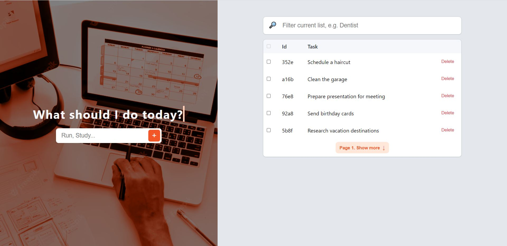
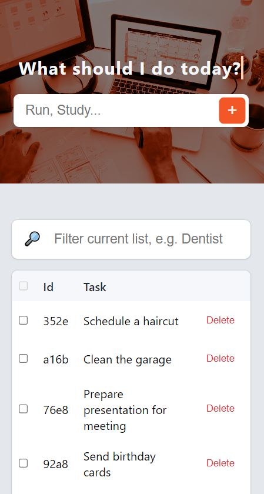

<h1 align="center">Task Manager App</h1>

  <a href="https://task-manager-tool.vercel.app/" target="_blank">
    
  <a/>

 

Thaixjacob - Full Stack Developer

<!-- LINK - BADGES -->

  
  
  

 

<!-- TABLE OF CONTENTS -->

  <a href="#about">About</a> •
  <a href="#built-with">Built with</a> •
  <a href="#code-quality">Code Quality</a> •
  <a href="#demo">Demo</a>

<h3 align="center">
   This is a full stack task management application designed to help you organize your daily activities and increase your productivity.
   With an intuitive interface, the Task Manager app is the perfect solution for individuals and teams who want to stay organized and meet important deadlines.  
   Easily add tasks (CREATE), find the tasks you want to do (READ), change their completion status (UPDATE), and delete those that are already done (DELETE).
</h3>

 

## Built with

> **Code**             **Production**      **Quality tools**          **Database**   
 

## Code Quality

Ensuring the functionality and reliability of an application is paramount, and that's why I emphasize thorough testing using Cypress. By focusing on clean code and rigorous end-to-end testing, I prioritize the creation of scalable and robust applications that meet industry standards and fulfill user requirements.

  

  
This approach guarantees that our application's primary feature, task creation, is thoroughly validated and capable of delivering an exceptional user experience.

 

## Demo

 

  <a href="https://task-manager-tool.vercel.app/" target="_blank">
    
  This project is deployed in Vercel, check it out by clicking on this link!
  </a>

 
 

<a href="/LICENSE">MIT License</a> - Copyright © 2023 - <a href="https://github.com/thaixjacob">Thais Jacob</a>

